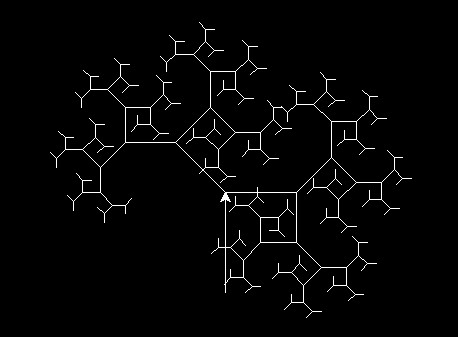
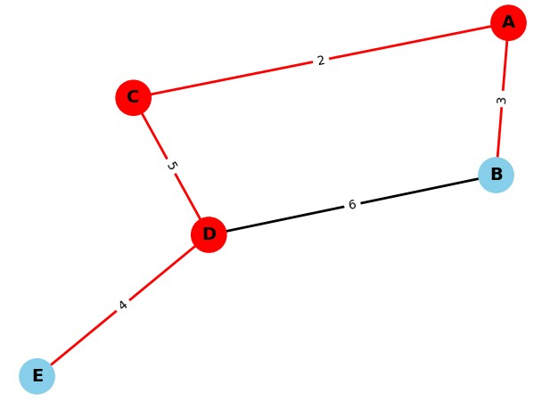
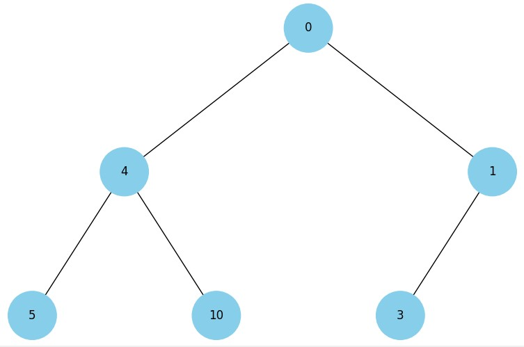
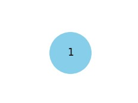

# Final project

This project includes several tasks related to data structures, sorting, recursion, tree traversal, shortest path algorithms, heap visualization, greedy algorithms, dynamic programming, and the Monte Carlo method.

## Task List:

**Task 1: Data Structures. Sorting. Working with a Singly Linked List**:

- Write a function that implements the reversal of a singly linked list by changing the links between the nodes.
- Develop a sorting algorithm for a singly linked list, for example, insertion sort or merge sort.
- Write a function that merges two sorted singly linked lists into one sorted list.

**Task 2: Recursion. Creation of the "Pythagoras tree" fractal using recursion**:

- You need to write a Python program that uses recursion to create a Pythagorean tree fractal. The program should visualize the Pythagorean tree fractal, and the user should be able to specify the level of recursion.

Startup example: python task_2.py --level 8

**Task 3: Trees, Dijkstra's algorithm**:

- Develop Dijkstra's algorithm for finding shortest paths in a weighted graph using a binary heap. The task involves creating a graph, using a pyramid to optimize the selection of vertices, and computing the shortest paths from the initial vertex to all others.

**Task 4: Visualization of the pyramid**:

- Build a function that will render a binary heap.

👉🏻 Note: The essence of the task is to create a tree from a pile.

Binary tree:

Binary heap:

**Task 5: Binary tree traversal visualization**:

- Using the code from Exercise 4 to build a binary tree, you need to create a Python program that visualizes the tree traversals: depth-first and breadth-first.

- It should display each step in nodes with different colors, using the 16-bit RGB system (example #1296F0). The colors of the nodes should change from dark to light shades, depending on the order of the traversal. Each node when visited should receive a unique color that visually reflects the order of the traversal.

👉🏻 Note: Use a stack and a queue, NOT recursion
