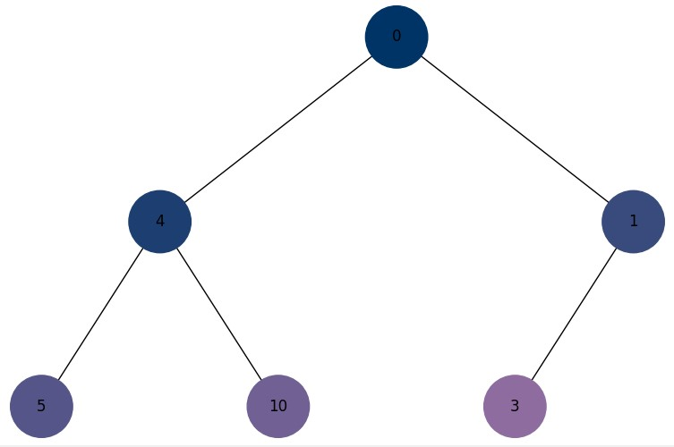

# Final project

This project includes several tasks related to data structures, sorting, recursion, tree traversal, shortest path algorithms, heap visualization, greedy algorithms, dynamic programming, and the Monte Carlo method.

## Task List:

**Task 1: Data Structures. Sorting. Working with a Singly Linked List**:

- Write a function that implements the reversal of a singly linked list by changing the links between the nodes.
- Develop a sorting algorithm for a singly linked list, for example, insertion sort or merge sort.
- Write a function that merges two sorted singly linked lists into one sorted list.

**Task 2: Recursion. Creation of the "Pythagoras tree" fractal using recursion**:

- You need to write a Python program that uses recursion to create a Pythagorean tree fractal. The program should visualize the Pythagorean tree fractal, and the user should be able to specify the level of recursion.

Startup example: python task_2.py --level 8

**Task 3: Trees, Dijkstra's algorithm**:

- Develop Dijkstra's algorithm for finding shortest paths in a weighted graph using a binary heap. The task involves creating a graph, using a pyramid to optimize the selection of vertices, and computing the shortest paths from the initial vertex to all others.

**Task 4: Visualization of the pyramid**:

- Build a function that will render a binary heap.

👉🏻 Note: The essence of the task is to create a tree from a pile.

Binary tree:

Binary heap:

**Task 5: Binary tree traversal visualization**:

- Using the code from Exercise 4 to build a binary tree, you need to create a Python program that visualizes the tree traversals: depth-first and breadth-first.

- It should display each step in nodes with different colors, using the 16-bit RGB system (example #1296F0). The colors of the nodes should change from dark to light shades, depending on the order of the traversal. Each node when visited should receive a unique color that visually reflects the order of the traversal.

👉🏻 Note: Use a stack and a queue, NOT recursion

**Task 6: Greedy algorithms and dynamic programming**:

- Need to write a Python program that uses two approaches—a greedy algorithm and a dynamic programming algorithm—to solve the problem of choosing a food with the highest total calorie content within a limited budget.

- Each type of food has a specified cost and calorie content. The food data is represented as a dictionary, where the key is the name of the dish and the value is a dictionary with the cost and calorie content.

items = {
"pizza": {"cost": 50, "calories": 300},
"hamburger": {"cost": 40, "calories": 250},
"hot-dog": {"cost": 30, "calories": 200},
"pepsi": {"cost": 10, "calories": 100},
"cola": {"cost": 15, "calories": 220},
"potato": {"cost": 25, "calories": 350}
}

Develop a greedy_algorithm function that selects dishes that maximize the calorie-to-cost ratio within a given budget.

To implement a dynamic programming algorithm, create a dynamic_programming function that calculates the optimal set of dishes to maximize calorie content within a given budget.

**Task 7: Using the Monte Carlo method**:

- You are required to write a Python program that simulates a large number of dice rolls, calculates the sums of the numbers that appear on the dice, and determines the probability of each possible sum.

- Create a simulation where two dice are rolled a large number of times. For each roll, determine the sum of the numbers that appear on both dice. Count how many times each possible sum (from 2 to 12) appears in the simulation. Using this data, calculate the probability of each sum.

- Based on the simulations, create a table or graph that displays the probabilities of each sum, as determined by the Monte Carlo method.

- The table of probabilities of the sums when rolling two dice looks like this. Translations

- Compare the results obtained using the Monte Carlo method with the analytical calculations given in the table above.

**Results task 7**:

- The Monte Carlo method approximates the theoretical probabilities well with a sufficiently large number of trials.

- The experimental results confirm that the most probable sum is 7, and the least probable are 2 and 12.

- The deviations between the simulation and analytical data decrease as the number of tosses increases
